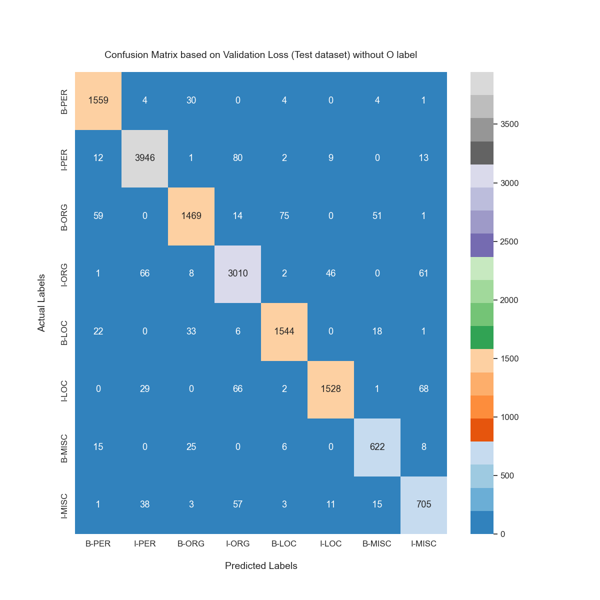

# Named Entity Recognition
## Goal
The main goal of the Named Entity Recognition task is to utilize Natural Language Processing methods to identify named entities in the given texts. In our project, the model is BERT-based classifier to identify named entities in the given texts.
## Model 
We developed BERT-based classifier for token classification task. BERT model from [HuggingFace](https://huggingface.co) was utilized as an encoder for this purpose. Hidden states of the model was provided to the FCN layer with shape of (hidden_size * num_classes), where hidden_size and num_classes stand for last hidden state dimension of the Transformer model and number of Named Entities in the dataset (9)
## Dataset
Project makes use of [conllpp](https://huggingface.co/datasets/conllpp) dataset from [HuggingFace](https://huggingface.co). As it is given in the source website, data splits were already made by authors. Explicitly, train, test and validation datasets include 14k, 3.45k and 3.25k sequences with their token labels, respectively. Class identification can be seen below:

       O:       0 =>  For other common tokens, which don't stand for any entity
       B-PER:   1 =>  Initial token of entity specifies Person
       I-PER:   2 =>  Intermediate token of entity specifies Person
       B-ORG:   3 =>  Initial token of entity specifies Organization
       I-ORG:   4 =>  Intermediate token of entity specifies Organization
       B-LOC:   5 =>  Initial token of entity specifies Location
       I-LOC:   6 =>  Intermediate token of entity specifies Location
       B-MISC:  7 =>  Initial token of entity specifies Miscallenous entity
       I-MISC:  8 =>  Intermediate token of entity specifies Miscallenous entity

## Model Results:
Basically the best results are as following (**Note: Model was fine tuned for 3 epochs only**):

       f1_macro:      0.9790 => Obtained at the 3rd epoch;
       dev_loss:      0.0781 => Obtained at the 1st epoch;
       dev_accuracy:  0.9261 => Obtained at the 3rd epoch;

### Confusion Matrices:
Initially we will provide confusion matices which were generated based on Validation dataset:

* Based on the best (minimum) validation loss, considering O label (left) and without O label (right):
       <p align="center">
            
            
        </p>
* Based on the best (maximum) validation accuracy, considering O label (left) and without O label (right):
       <p align="center">
            
            
        </p>
* Based on the best (maximum) F1 score, considering O label (left) and without O label (right):
       <p align="center">
            
            
        </p>

Confusion matrices based on the test dataset are given below:

* Based on the best (minimum) validation loss, considering O label (left) and without O label (right):
       <p align="center">
            
            
        </p>
* Based on the best (maximum) validation accuracy, considering O label (left) and without O label (right):
       <p align="center">
            
            
        </p>
* Based on the best (maximum) F1 score, considering O label (left) and without O label (right):
       <p align="center">
            
            
        </p>
## How to run easily?
After you direct yourself into some folder that you want to add this model, you can follow steps below step by step:

* Initially, you need to pull the project into your local machine

  in Colab (or any other Notebook):
  ```python  
  !git clone git clone https://github.com/NamazovMN/NER-BERT.git
  ```

  in Terminal:
  ```python  
  git clone git clone https://github.com/NamazovMN/NER-BERT.git
  ```
* Then, you should run the following snippet to install all required dependencies: 
  in Colab (or any other Notebook):
  ```python  
  !pip install -r requirements.txt
  ```
  in Terminal:
  ```python  
  pip install -r requirements.txt
  ```
* In order to train, infer and show statistics the following snippet can be run. Notice that, further details of each step and parameters can be found in ipynb file:

  ```python
  python main.py --experiment_num 1 --train --epochs 3 --stats --statistics_data_choice validation --infer --load_best --load_choice f1_macro
  ```
  This snippet will do following steps:
  
         Train the model for 3 epochs and save results in results/experiment_1
    
         Provide statistics and visualize results (confusion matrix)
    
         Ask you provide a text for entity recognition

## Useful Data:
* You can reach to the best epoch checkpoint of the model (based on F1 score) from the [model checkpoint](https://drive.google.com/file/d/1-ep48ThsTStxFBk5BmnQ99uULXD6F76i/view?usp=drive_link), which link is available for whom have the link. 
* [NER_bert.ipynb](NER_bert.ipynb) and [ner_bert.ipynb](ner_bert.ipynb) notebooks are also provided in this repository. While the first one is the same code but in notebook format (for whom can follow easily from such format), the latter was developed as a guidance for 'run from terminal' manner. 
 
 ***Regards,***

***Mahammad Namazov***
